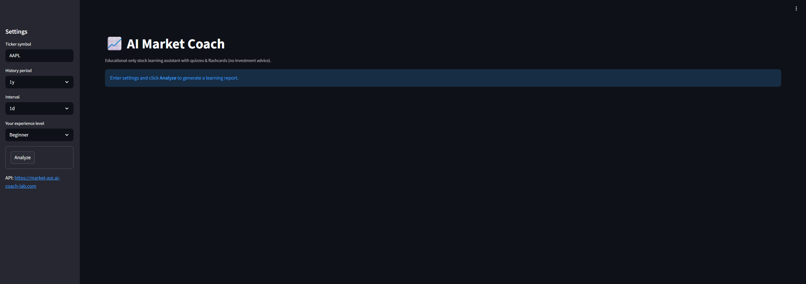
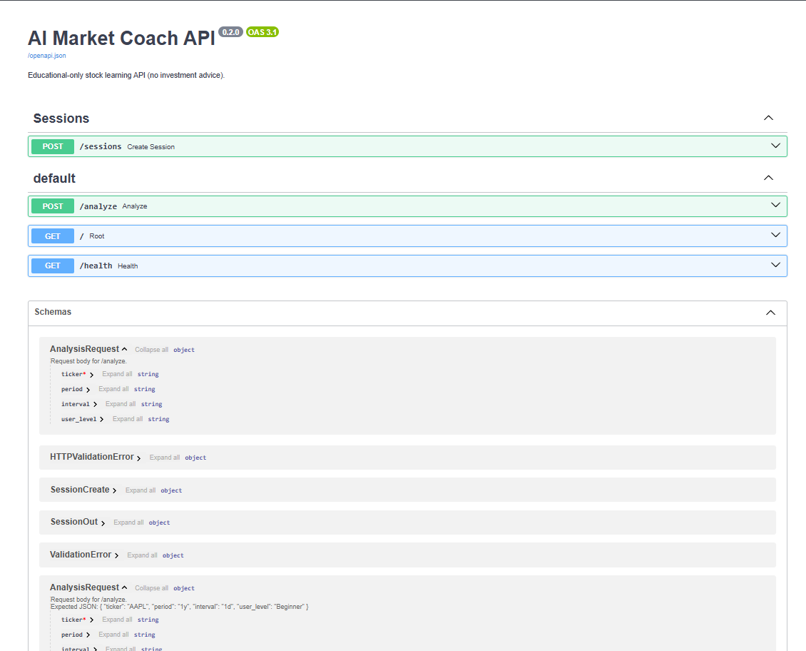
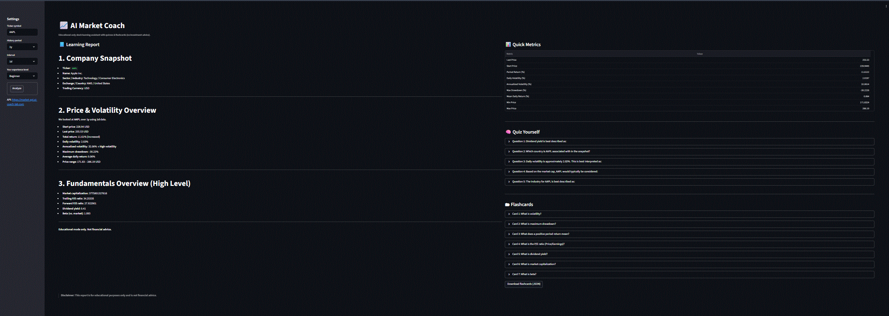

# 📈 AI Market Coach

<p align="center">
  
  
  
  
  
  
</p>

**Educational-only stock learning and analytics assistant.**  
AI Market Coach helps users learn market concepts by converting historical market data into metrics, plain-English explanations, quizzes, and flashcards.

> ⚠️ **Disclaimer:** This project is for educational purposes only and does not provide financial, trading, or investment advice.

## 🌐 Live Links (Production)

- **UI:** https://market.ai-coach-lab.com  
- **API Docs (Swagger):** https://market-api.ai-coach-lab.com/docs  
- **Health Check:** https://market-api.ai-coach-lab.com/health

## 🖼️ App Preview

### Streamlit UI



### API Documentation (Swagger)



### Demo Walkthrough



## ✅ What This App Does

AI Market Coach combines:

- **Market data retrieval** (`yfinance`)
- **Analytics** (returns, volatility, drawdown, summary stats)
- **Optional local LLM coaching** via **Ollama**
- **Practice mode** via quizzes + flashcards
- **DB-backed endpoints** (sessions stored in Postgres)

## ✅ Features

| Category | Feature | Description |
|---|---|---|
| Market Data | Historical price pull | Fetches OHLC/time-series data using `yfinance` |
| Analytics | Core metrics | Returns %, volatility, max drawdown, range summary |
| Learning | AI learning report | Plain-English learning report (Ollama optional) |
| Learning | Quiz + flashcards | Practice questions + flashcards returned by API |
| Backend | Sessions | `/sessions` endpoint stored in Postgres |
| Platform | UI + API separation | Streamlit UI calls FastAPI backend over HTTP/HTTPS |
| Deployment | Cloud-ready | Dockerized and deployed to Azure App Service |

## 🧠 Architecture

### Production

- **Streamlit UI (public):** `market.ai-coach-lab.com`
- **FastAPI API (public):** `market-api.ai-coach-lab.com`
- Cloudflare handles DNS (CNAME)
- Azure App Service handles hosting + SSL

```mermaid
flowchart LR
  U["User (Browser)"] --> UI["Streamlit UI<br/>market.ai-coach-lab.com"]
  UI -->|HTTPS JSON| API["FastAPI API<br/>market-api.ai-coach-lab.com"]
  API --> YF["yfinance market data"]
  API --> DB["Postgres (sessions)"]
  API --> LLM["Ollama (optional)"]
